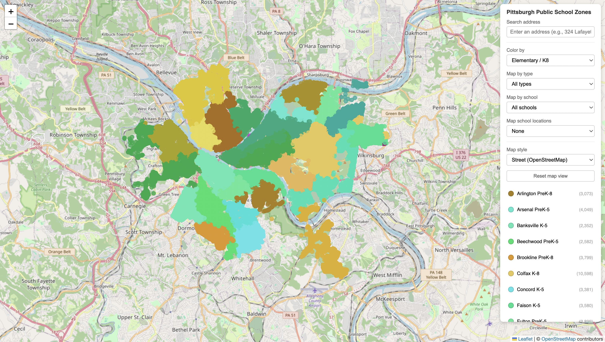

# PPS School Zone Map



## About This Project

For Pittsburgh residents, figuring out which public schools a home address is assigned to is surprisingly difficult.

Attendance zones form a patchwork of irregular shapes, jagged boundaries, and even discontinuous areas. While [data](https://data.wprdc.org/dataset/pittsburgh-public-schools-enrollment/resource/643511e3-e99a-4e2a-94a4-033ddb944e94), [static maps](https://www.wesa.fm/education/2018-10-22/strange-shapes-jagged-lines-the-patchwork-of-pittsburgh-school-zones), and the district's [school search portal](https://app.guidek12.com/pittsburghpa/school_search/current/) exist, there is no single, simple way to interactively look up school assignments by residential address or neighborhood.

This tool addresses that gap by visualizing Pittsburgh Public Schools (PPS) attendance zones and showing school assignments for each address across elementary, middle, and high school levels.

Each point represents a geocoded address within the PPS district. Colors indicate the assigned school for the selected grade level using the Color by option.

Ultimately, this project aims to make school boundary information more transparent and accessible for families, homebuyers, and community members.

## How to use

- **School year** — toggle between current school assignments and projected 2027–28 assignments using the tabs at the top of the sidebar. The 2027–28 dataset reflects planned school consolidations and closures taking effect for the 2027–28 school year.
- **Click a point** — view detailed school assignments for that specific address.
- **Search address** — type an address to zoom to it and see its school assignments.
- **Map by type** — map address zones for a given school level.
- **Map by school** — highlight all addresses assigned to a specific school.
- **Map school locations** — illustrate where various public schools are located throughout the city.
- **Browse schools by grade level** - filters the legend to show Elementary/K8, Middle, or High Schools. Click any school name in the legend to highlight all addresses assigned to that school.
- **Map style** — choose from `Street`, `Light`, `Dark`, or `Satellite` backgrounds. Selecting `Dark` also switches the sidebar to a dark theme.

## Data

- Citywide address data is sourced from [OpenAddresses.io](https://openaddresses.io/).
- School zone data is sourced from PPS's [School Search Tool]("https://app.guidek12.com/pittsburghpa/school_search/current/).
- Map tiles by [OpenStreetMap](https://www.openstreetmap.org) contributors.

## Notes

- Magnet schools and programs (e.g., CAPA, Obama Academy of International Studies, Montessori PreK–5, etc.) are not tied to specific neighborhoods and are not included in this tool.
- School districts outside of PPS are not included.
- School assignments shown here reflect standard attendance boundaries and do not account for transfers, magnet placements, or other special enrollment cases.
- Attendance boundaries may change over time; assignments shown here reflect the most recent available data.

## Project Structure

```
pps-school-zone-map/
├── .github/
│   └── workflows/
│       └── monthly-refresh.yml   # GitHub Actions workflow for automated monthly data refresh
├── assets/
│   └── app-home-screen.png       # Screenshot used in this README
├── backups/                      # Point-in-time snapshots of data and scripts for recovery
├── data/
│   ├── addresses.bin             # Compact binary encoding of geocoded address data (served to the frontend)
│   ├── addresses_full.json       # Full address records with all fields from the pipeline
│   ├── addresses_slim.json       # Slimmed-down address records used during the build step
│   ├── pittsburgh_addresses.json # Raw Pittsburgh address data from OpenAddresses.io
│   └── schools.json              # School metadata (name, type, location) scraped from PPS
├── img/
│   └── favicon-*.svg             # SVG favicons that change based on the selected grade-level filter
├── pipeline/
│   ├── build_binary.py           # Converts processed address JSON into the compact binary format
│   ├── refresh_schools.py        # Refreshes school metadata from the PPS school search portal
│   └── scraper-v2.py             # Scrapes school zone assignments for each Pittsburgh address
├── tests/
│   ├── js/                       # JavaScript unit tests
│   ├── test_build_binary.py      # Tests for the binary build step
│   ├── test_main.py              # Tests for main.py
│   ├── test_refresh_schools.py   # Tests for the school refresh script
│   └── test_scraper.py           # Tests for the scraper
├── index.html                    # Main application entry point
├── index.js                      # Frontend application logic (map rendering, filtering, search)
├── main.py                       # Orchestrates the full data pipeline end-to-end
├── requirements.txt              # Python runtime dependencies
├── requirements-dev.txt          # Additional Python dependencies for development and testing
├── styles.css                    # Application styles
└── sw.js                         # Service worker for offline support and asset caching
```

## Running Locally

No build step is required. The pre-built data files are committed to the repository, so the app is ready to use immediately after cloning.

1. **Clone the repository**

   ```bash
   git clone https://github.com/mgermaine93/pps-school-zone-map.git
   cd pps-school-zone-map
   ```

2. **Serve the directory** with any static file server

   ```bash
   python3 -m http.server 8000
   # or: npx serve .
   ```

3. Open `http://localhost:8000` in a browser.

To regenerate the underlying data from scratch, see the [pipeline README](pipeline/README.md).

## Disclaimer

- This tool draws from official sources (e.g., the PPS portal), but is intended for informational use and should not be considered an official PPS source.
- This tool was developed with the assistance of AI agentic coding tools, including [Claude Code](https://code.claude.com/docs/en/overview), as part of an experimental, educational hobby project.

## About the Author

This project was designed and developed by [Matt Germaine](https://www.linkedin.com/in/matthewgermaine/) as a personal exploration of geospatial data visualization and civic technology.

View the source code on [GitHub](https://github.com/mgermaine93/pps-school-zone-map).

## Live URL

[https://mgermaine93.github.io/pps-school-zone-map/](https://mgermaine93.github.io/pps-school-zone-map/)

Data last updated: September 2026.
